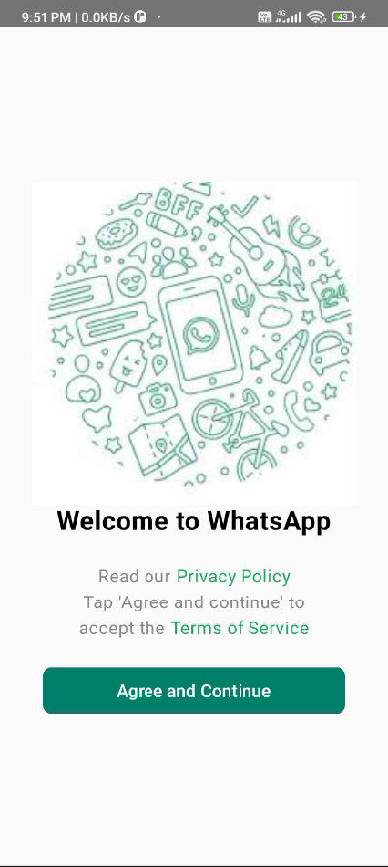
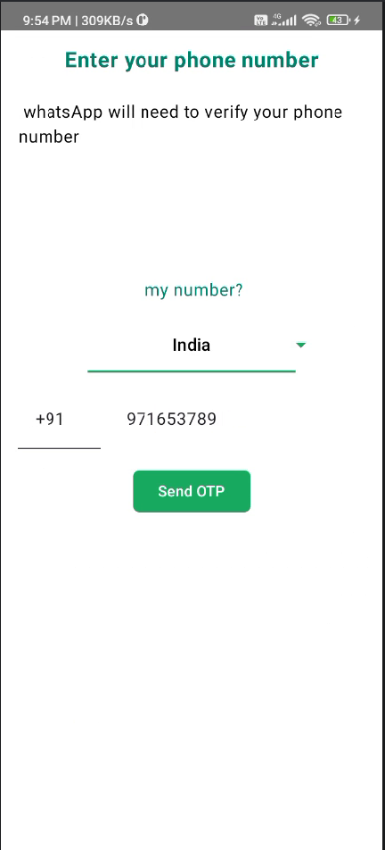
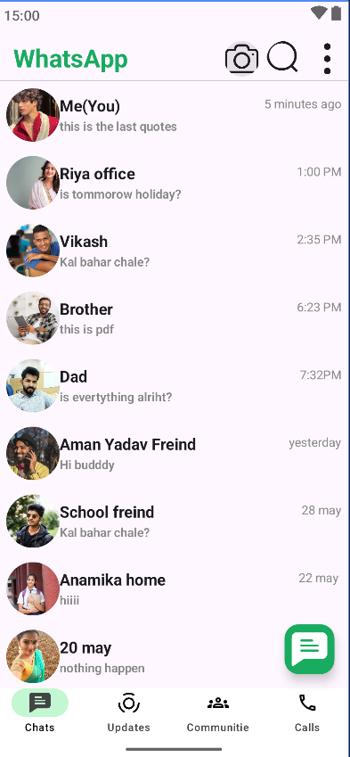
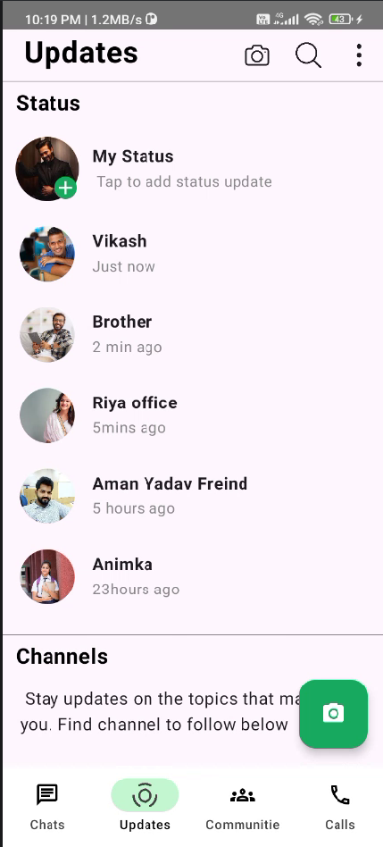
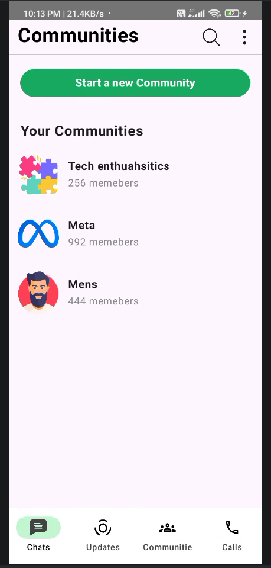
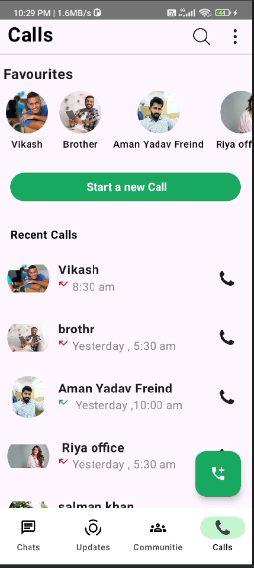

# WhatsApp Clone - Jetpack Compose

A modern WhatsApp-inspired Android application built using **Kotlin**, **Jetpack Compose**, **MVVM Architecture**, and **Firebase Authentication**.

---

## 📱 Application Preview

## 📱 Screenshots

<h2 align="center">📱 Application Preview</h2>

<table align="center">
  <tr>
    <td align="center">
      <br>
      <b>Welcome Screen</b>
    </td>
    <td align="center">
      <br>
      <b>Login Screen</b>
    </td>
  </tr>

  <tr>
    <td align="center">
      <br>
      <b>Home Screen</b>
    </td>
    <td align="center">
      <br>
      <b>Status Screen</b>
    </td>
  </tr>

  <tr>
    <td align="center">
      <br>
      <b>Communities Screen</b>
    </td>
    <td align="center">
      <br>
      <b>Call Screen</b>
    </td>
  </tr>
</table>

---

## 🚀 Features

* Modern WhatsApp Inspired UI
* Splash Screen
* Welcome Screen
* Phone Authentication Flow
* Chat List UI
* Status Updates Screen
* Communities Screen
* Call Screen
* Bottom Navigation
* Floating Action Buttons
* MVVM Architecture
* Firebase Authentication
* Material 3 Design
* Jetpack Compose Navigation

---

## 🛠 Tech Stack

* Kotlin
* Jetpack Compose
* Material 3
* Firebase Authentication
* MVVM Architecture
* Navigation Component
* Hilt Dependency Injection
* Firebase Realtime Database

---

## 📂 Project Structure

```text
app
├── di
├── models
├── presentation
│   ├── homescreen
│   ├── callscreen
│   ├── communitiesscreen
│   ├── updatescreen
│   ├── profile
│   ├── splashscreen
│   ├── welcomescreen
│   ├── userregestrationscreen
│   └── navigation
└── ui.theme
```

---

## ⚙️ Installation

### Clone Repository

```bash
git clone https://github.com/RahulThakur-28/WhatsApp-Clone-Jetpack-Compose.git
```

### Open Project

```bash
Open in Android Studio
```

### Sync Gradle

```bash
Sync Project with Gradle Files
```

### Run App

```bash
Run on Emulator or Physical Device
```

---

## 🎯 Learning Outcomes

This project helped me learn:

* Jetpack Compose UI Development
* Android Navigation
* State Management
* MVVM Architecture
* Firebase Authentication
* Realtime Database Integration
* Dependency Injection using Hilt
* Android Project Structure
* Reusable UI Components

---

## 👨‍💻 Developer

**Rahul Thakur**

GitHub:
https://github.com/RahulThakur-28

---

## ⭐ Support

If you found this project useful, consider giving it a Star ⭐.
